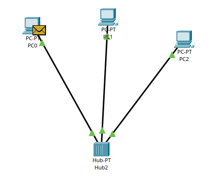
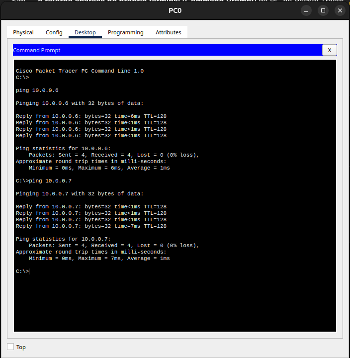
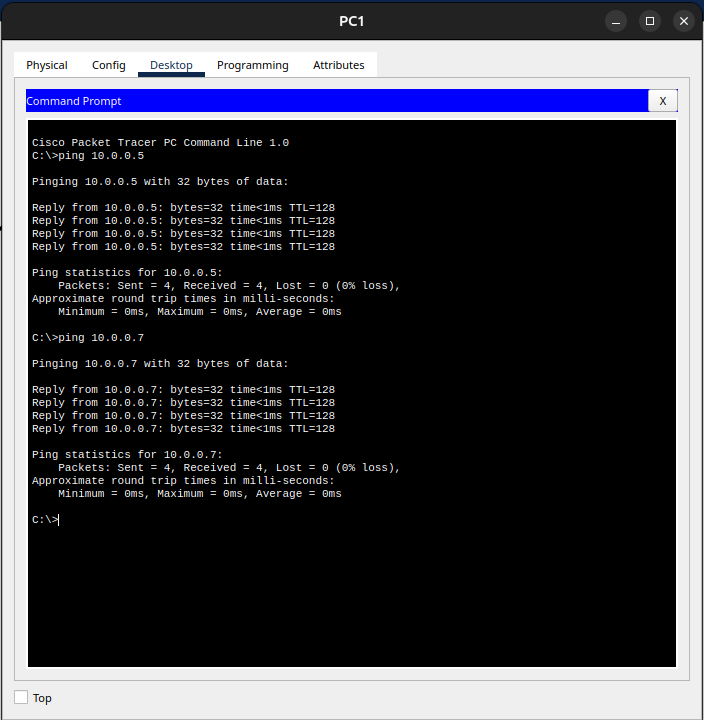
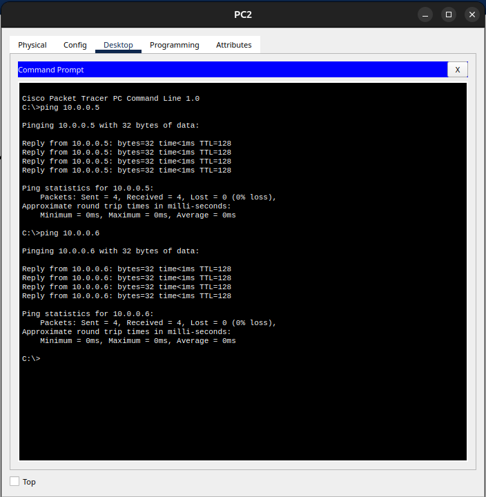
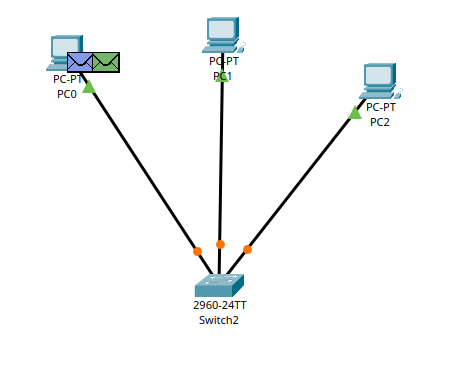

# Relatório Técnico – Análise de Propagação de Sinal em Redes com Hub e Switch

# 1. Parte 1 – Rede com HUB

## 1.1 Topologia da Rede

A rede foi montada com três computadores conectados a um **hub**, utilizando cabos de par trançado.

### Topologia

## 1.2 Teste de Conectividade

Após a configuração dos endereços IP, foram realizados testes de conectividade utilizando o comando **ping** entre todos os dispositivos da rede.

### Exemplo de teste de ping

Os resultados indicaram que todos os dispositivos conseguem se comunicar corretamente.

## 1.3 Simulação de PDU

Foi enviada uma **Simple PDU do PC0 para o PC2** utilizando o modo de simulação do Packet Tracer.

### Simulação da propagação da PDU

<video src="./assets/simulacao_hub.mp4" controls width="100%"></video>

Durante a simulação foi possível observar que o hub replica o sinal para todas as portas.

## 1.4 Análise

### a) Por que todos os nós recebem o quadro inicialmente dentro de um hub?

Um **hub opera na camada física (camada 1 do modelo OSI)** e não possui capacidade de analisar endereços MAC ou identificar o destino de um quadro. Quando um dispositivo envia um sinal elétrico para o hub, ele simplesmente **replica esse sinal para todas as portas conectadas**. Dessa forma, todos os dispositivos recebem o quadro inicialmente, mesmo que apenas um seja o destinatário correto. Os dispositivos que não correspondem ao endereço de destino apenas descartam o quadro após verificar o endereço MAC.

### b) Explique como isso se relaciona ao conceito de meio compartilhado com desempenho real na camada física.

Em redes com hub, todos os dispositivos compartilham o **mesmo meio físico de transmissão**. Isso significa que o sinal transmitido por um dispositivo é propagado para todos os demais. Como consequência, apenas um dispositivo pode transmitir por vez, caracterizando um **domínio de colisão único**. Quando múltiplos dispositivos tentam transmitir simultaneamente, podem ocorrer colisões, reduzindo o desempenho da rede.

# 2. Parte 2 – Rede com SWITCH

## 2.1 Topologia da Rede

No segundo cenário, o hub foi substituído por um **switch 2960**, mantendo os mesmos computadores, endereços IP e cabeamento.

### Topologia

## 2.2 Simulação de PDU

Foi enviada novamente uma **Simple PDU do PC0 para o PC2**.

### Simulação da PDU com switch

<video src="./assets/simulacao_switch.mp4" controls width="100%"></video>

Foi possível observar que o switch encaminha o quadro apenas para a porta correspondente ao dispositivo de destino.

## 2.3 Análise

### a) Compare o fluxo do sinal elétrico no switch versus hub.

No **hub**, o sinal elétrico recebido em uma porta é replicado para todas as outras portas, pois o dispositivo opera apenas na **camada física do modelo OSI** e não possui capacidade de analisar os quadros transmitidos.

Já o **switch opera na camada de enlace (camada 2)** e consegue analisar os **endereços MAC presentes nos quadros Ethernet**. Ao receber um quadro, o switch consulta sua **tabela MAC** e encaminha o quadro apenas para a porta onde o dispositivo de destino está conectado.

### b) Por que agora a PDU não é propagada para todos os nós da mesma forma?

A PDU não é propagada para todos os dispositivos porque o switch mantém uma **tabela de endereços MAC** que associa cada dispositivo à porta correspondente. Dessa forma, quando um quadro chega ao switch, ele verifica o endereço MAC de destino e encaminha o quadro apenas para a porta correta, evitando a transmissão desnecessária para todos os nós da rede.

### c) O switch elimina o meio físico compartilhado? Justifique tecnicamente.

O switch não elimina completamente o meio físico compartilhado, pois os dispositivos ainda utilizam o mesmo equipamento de rede e o mesmo tipo de cabeamento. Entretanto, ele **segmenta o domínio de colisão**, criando um domínio de colisão separado para cada porta. Isso permite que diferentes dispositivos transmitam dados simultaneamente sem gerar colisões entre si, aumentando significativamente a eficiência da rede.

# 3. Comparação entre os Cenários

| Característica | Hub | Switch |
|---|---|---|
Camada OSI | Camada 1 (Física) | Camada 2 (Enlace) |
Encaminhamento | Replica sinal para todas as portas | Encaminha apenas para a porta correta |
Domínio de colisão | Único | Um por porta |
Eficiência | Baixa | Alta |

# 4. Conclusão

A análise dos dois cenários demonstrou diferenças significativas no comportamento da rede. O hub simplesmente replica o sinal para todos os dispositivos conectados, caracterizando um meio físico totalmente compartilhado e sujeito a colisões. Já o switch utiliza informações da camada de enlace para encaminhar os quadros de forma seletiva, reduzindo o tráfego desnecessário e aumentando a eficiência da comunicação. Dessa forma, switches são amplamente utilizados em redes modernas devido à sua maior capacidade de gerenciamento do tráfego de dados.

# 5. Vídeo de Demonstração

Link para o vídeo explicativo da atividade: [clique aqui](https://drive.google.com/drive/folders/1_0hNELhfy9Pz6XS63Iv_2kg9yZqLYrKS?usp=sharing)
